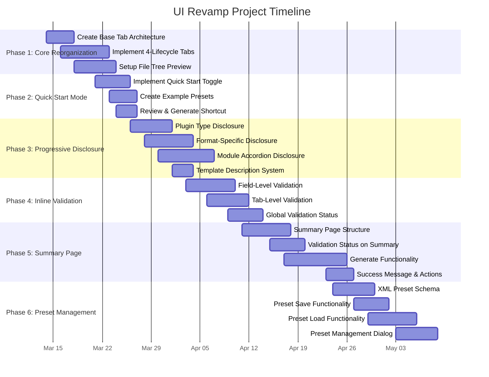

# UI Revamp Project - Gantt Chart & Task Breakdown

**Project Start:** March 14, 2026
**Target Completion:** August 2026 (aiming for sooner)
**Team:** 2-3 people (using AI assistance)

---

## Gantt Chart Overview



---

## Parallel Task Execution Map

### Can Start in Parallel (No Dependencies)

**Starting Week 1 (March 14-21):**
- ✓ Create Base Tab Architecture (Epic #1)
- Implement 4-Lifecycle Tabs Structure (Epic #2) - **BLOCKED** on Epic #1
- Setup File Tree Preview (Epic #3) - **NO DEPENDENCY** - Can run parallel to Epic #1

**Starting Week 2 (March 21-April 1):**
- Implement File Tree Preview (Epic #3) - Started in Week 1
- Implement Quick Start Toggle (Epic #4) - **NO DEPENDENCY** - Can start
- Create Example Presets (Epic #5) - **NO DEPENDENCY** - Can start
- Review & Generate Shortcut (Epic #6) - **BLOCKED** on Epic #4

**Starting Week 3 (March 28-April 4):**
- Format-Specific Disclosure (Epic #8) - **BLOCKED** on Tab 2 implementation (Epic #2)
- Module Accordion Disclosure (Epic #9) - **NO DEPENDENCY** - Can start
- Template Description System (Epic #10) - **NO DEPENDENCY** - Can run parallel with Epic #9

**Starting Week 4 (April 3-April 10):**
- Field-Level Validation (Epic #11) - **NO DEPENDENCY** - Can start
- Tab-Level Validation (Epic #12) - **BLOCKED** on all tabs structure (Epic #2)
- Global Validation Status (Epic #13) - **BLOCKED** on Epic #11, #12

**Starting Week 5 (April 10-April 17):**
- Summary Page Structure (Epic #14) - **BLOCKED** on all tabs (Epic #2) + validation (Epic #11-13)
- Validation Status on Summary (Epic #15) - **BLOCKED** on Epic #14
- Implement Generate Functionality (Epic #16) - **NO DEPENDENCY** - Can start (backend work)

**Starting Week 6 (April 17-April 30):**
- XML Preset Schema (Epic #18) - **NO DEPENDENCY** - Can start
- Preset Save Functionality (Epic #19) - **BLOCKED** on Epic #18
- Success Message & Actions (Epic #17) - **NO DEPENDENCY** - Can run parallel with Epic #16

**Starting Week 7 (April 24-May 7):**
- Preset Load Functionality (Epic #20) - **BLOCKED** on Epic #18
- Preset Management Dialog (Epic #21) - **BLOCKED** on Epic #19, #20

---

## Task Dependency Graph

```
[EPIC #1: Base Tab Architecture]
       ↓
[EPIC #2: 4-Lifecycle Tabs]
   ↓           ↓
[EPIC #4]    [EPIC #7: Plugin Type Disclosure]
   ↓           ↓
[EPIC #6]    [EPIC #8: Format-Specific]
↓            ↓
             [EPIC #9]
                ↓
             [EPIC #11: Field-Level Validation]
                ↓
             [EPIC #12: Tab-Level Validation]
                ↓
             [EPIC #13: Global Validation]
                ↓
             [EPIC #14: Summary Page]
                ↓
             [EPIC #15: Validation Status]

[EPIC #3: File Tree Preview] ← STARTS PARALLEL
             ↓ (integrates with all tabs)

[EPIC #5: Example Presets] ← STARTS PARALLEL
             ↓
       [EPIC #18: XML Preset Schema]
          ↓           ↓
      [EPIC #19]    [EPIC #20]
          ↓           ↓
          [EPIC #21: Preset Dialog]

[EPIC #16: Generate Functionality] ← STARTS PARALLEL
             ↓
       [EPIC #17: Success Message]
```

---

## Phase-by-Phase Breakdown with Parallel Opportunities

### Phase 1: Core Reorganization (March 14 - March 22)

**Critical Path:**
1. Epic #1: Base Tab Architecture (4 days)
2. Epic #2: 4-Lifecycle Tabs (7 days, blocked on #1)

**Can Run Parallel:**
- Epic #3: File Tree Preview (6 days) - **START March 18** while Epic #2 runs

**Parallel Tasks:**
- Epic #1: Base Tab Architecture (4 days) - Person A
- Epic #3: File Tree Preview (6 days) - Person B (starts day 4)

---

### Phase 2: Quick Start Mode (March 21 - March 26)

**Critical Path:**
1. Epic #4: Quick Start Toggle (5 days)
2. Epic #6: Review & Generate Shortcut (3 days, blocked on #4)

**Can Run Parallel:**
- Epic #5: Example Presets (4 days) - **NO DEPENDENCY** - Starts immediately

**Parallel Tasks:**
- Epic #4: Quick Start Toggle (5 days) - Person A
- Epic #5: Example Presets (4 days) - Person B

---

### Phase 3: Progressive Disclosure (March 26 - April 5)

**Critical Path:**
1. Epic #7: Plugin Type Disclosure (6 days, blocked on Epic #2)
2. Epic #8: Format-Specific Disclosure (7 days, blocked on Epic #2)

**Can Run Parallel:**
- Epic #9: Module Accordion Disclosure (8 days) - **NO DEPENDENCY** - Starts immediately
- Epic #10: Template Description System (3 days) - **NO DEPENDENCY** - Starts with Epic #9

**Parallel Tasks:**
- Epic #7 + Epic #8: Format disclosures (9 days total, some overlap) - Person A
- Epic #9: Module Accordion (8 days) - Person B
- Epic #10: Template descriptions (3 days) - Person B (can start late in Epic #9)

---

### Phase 4: Inline Validation (April 3 - April 12)

**Critical Path:**
1. Epic #11: Field-Level Validation (7 days) - **NO DEPENDENCY**
2. Epic #12: Tab-Level Validation (6 days, blocked on all tabs + Epic #11)
3. Epic #13: Global Validation Status (5 days, blocked on Epic #11, #12)

**Parallel Tasks:**
- Epic #11: Field-Level Validation (7 days) - Person A
- Epic #16: Generate Functionality (9 days, starts a bit later) - Person B → **PHASE 5 START EARLY**

---

### Phase 5: Summary Page (April 11 - April 25)

**Critical Path:**
1. Epic #14: Summary Page Structure (7 days, blocked on all tabs + validation)
2. Epic #15: Validation Status (5 days, blocked on Epic #14)

**Can Run Parallel:**
- Epic #16: Generate Functionality (9 days) - **NO DEPENDENCY** - Started in Phase 4
- Epic #17: Success Message (4 days) - Can start with Epic #16

**Parallel Tasks:**
- Epic #14 + Epic #15: Summary work (12 days total) - Person A
- Epic #16 + Epic #17: Generation work (13 days total) - Person B

---

### Phase 6: Preset Management (April 24 - May 7)

**Critical Path:**
1. Epic #18: XML Preset Schema (6 days) - **NO DEPENDENCY**
2. Epic #19: Preset Save (5 days, blocked on #18)
3. Epic #20: Preset Load (7 days, blocked on #18)
4. Epic #21: Preset Dialog (6 days, blocked on #19, #20)

**Parallel Tasks:**
- Epic #18: Schema (6 days) - Person A
- Epic #19 + Epic #20: Save/Load can run parallel after schema (7 days) - Person A + Person B

---

## Optimized Timeline with Maximum Parallelization

### Week 1 (March 14-20)
- Person A: Epic #1 (Base Tab) - 4 days + Start Epic #2 (Tabs)- 3 days
- Person B: Epic #3 (File Tree) - 6 days
- **PARALLEL:** Base Tab + File Tree

### Week 2 (March 21-27)
- Person A: Epic #2 (Tabs) - 4 days remaining + Epic #4 (Quick Start) - 3 days
- Person B: Epic #3 (File Tree) - 2 days remaining + Epic #5 (Example Presets) - 4 days
- **PARALLEL:** Tabs + Quick Start + File Tree + Example Presets

### Week 3 (March 28-April 3)
- Person A: Epic #4 (Quick Start) - 2 days remaining + Epic #7 (Plugin Type) - 4 days
- Person B: Epic #5 (Example Presets) - 2 days remaining + Epic #9 (Module Accordion) - 5 days
- **PARALLEL:** Quick Start + Plugin Type + Example Presets + Module Accordion

### Week 4 (April 4-10)
- Person A: Epic #7 (Plugin Type) - 4 days remaining + Epic #8 (Format) - 3 days + Epic #11 (Field Validation) - 3 days
- Person B: Epic #9 (Module Accordion) - 4 days remaining + Epic #10 (Template Descriptions) - 3 days
- **PARALLEL:** Plugin Type + Format + Module Accordion + Template + Field Validation

### Week 5 (April 11-17)
- Person A: Epic #8 (Format) - 4 days remaining + Epic #12 (Tab Validation) - 3 days
- Person B: Epic #11 (Field Validation) - 4 days remaining + Epic #13 (Global Validation) - 2 days + Epic #16 (Generate) - 3 days
- **PARALLEL:** Format + Tab Validation + Field Validation + Global Validation + Generate

### Week 6 (April 18-24)
- Person A: Epic #12 (Tab Validation) - 4 days remaining + Epic #14 (Summary) - 3 days
- Person B: Epic #13 (Global Validation) - 3 days remaining + Epic #16 (Generate) - 4 days remaining + Epic #17 (Success Message) - 3 days
- **PARALLEL:** Tab Validation + Summary + Global Validation + Generate + Success Message

### Week 7 (April 25-May 1)
- Person A: Epic #14 (Summary) - 5 days remaining + Epic #15 (Validation Status) - 3 days + Epic #18 (Preset Schema) - 2 days
- Person B: Epic #16 (Generate) - 1 day remaining + Epic #18 (Preset Schema) - 4 days remaining
- **PARALLEL:** Summary + Validation Status + Preset Schema + Generate

### Week 8 (May 2-7)
- Person A: Epic #18 (Preset Schema) - 3 days remaining + Epic #19 (Preset Save) - 3 days
- Person B: Epic #18 (Preset Schema) - 2 days remaining + Epic #20 (Preset Load) - 4 days
- **PARALLEL:** Preset Schema + Preset Save + Preset Load

### Week 9 (May 8-14)
- Person A: Epic #21 (Preset Dialog) - 5 days
- Person B: Integration testing, docs, bug fixes
- **PARALLEL:** Preset Dialog + Testing/Docs

**OPTIMIZED TARGET COMPLETION: Mid-May 2026** (5 weeks ahead of August deadline!)

---

## Resource Allocation Strategy

### Person A (Architecture & UI Focus)
**Weeks 1-9:**
- Base Tab Architecture
- Tab Structure
- Validation System
- Summary Page
- Preset Save Functionality

### Person B (Features & Backend Focus)
**Weeks 1-9:**
- File Tree Preview
- Example Presets
- Module Accordion
- Generate Functionality
- Preset Load Functionality

### Person C (when available, Week 5-9)
**Weeks 5-9:**
- Testing & QA
- Documentation
- Bug Fixes
- Edge Cases
- Performance Optimization

---

## Risk Mitigation

### Dependencies That Could Block Progress
1. **Epic #2 (Tabs) blocks Epic #7, #8, #12, #14** - Ensure Epic #1 done early
2. **Epic #18 (Preset Schema) blocks Epic #19, #20, #21** - Start early in Phase 6

### Buffer Time
- Add 20% buffer to all estimates
- Allow for AI rewrites and refactoring
- Account for integration testing
- Leave time for edge cases

### Critical Path Watchpoints
- **Week 2:** Ensure Epic #1 complete before Epic #2 delays
- **Week 5:** Ensure validation system ready before Summary page
- **Week 7:** Ensure preset schema done before save/load tasks

---

## Milestones

1. **March 16:** Base Tab Architecture complete
2. **March 26:** All 4 tabs functional
3. **April 3:** Progressive Disclosure complete
4. **April 12:** Validation system fully functional
5. **April 25:** Generate + Summary page working end-to-end
6. **May 7:** Preset system complete
7. **May 14:** Testing, Docs, Bug Fixes - READY FOR RELEASE

---

## Status Tracking Legend

- 🟢 On Track
- 🟡 At Risk
- 🔴 Blocked
- ⚪ Not Started
- 🔵 In Progress
- ✅ Complete

---

## Notes

- All estimates include coding, testing, and documentation
- Allow for AI tool latency and rewrites
- Parallel execution assumes tasks can truly be worked on independently
- Integration tasks (connecting pieces together) not explicitly shown but built into estimates
- Final 2 weeks reserved for integration, testing, and polish