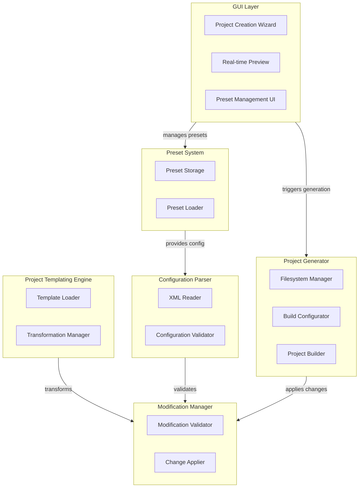

```mermaid
flowchart TB
    subgraph ProjectTemplatingEngine["Project Templating Engine"]
        TemplateLoader["Template Loader"]
        TransformationManager["Transformation Manager"]
    end
    
    subgraph ConfigurationParser["Configuration Parser"]
        XMLReader["XML Reader"]
        ConfigurationValidator["Configuration Validator"]
    end
    
    subgraph ModificationManager["Modification Manager"]
        ModificationValidator["Modification Validator"]
        ChangeApplier["Change Applier"]
    end
    
    subgraph PresetSystem["Preset System"]
        PresetStorage["Preset Storage"]
        PresetLoader["Preset Loader"]
    end
    
    subgraph ProjectGenerator["Project Generator"]
        FilesystemManager["Filesystem Manager"]
        BuildConfigurator["Build Configurator"]
        ProjectBuilder["Project Builder"]
    end
    
    subgraph GUILayer["GUI Layer"]
        ProjectCreationWizard["Project Creation Wizard"]
        RealTimePreview["Real-time Preview"]
        PresetManagementUI["Preset Management UI"]
    end
    
    ProjectTemplatingEngine -->|"transforms"| ModificationManager
    ConfigurationParser -->|"validates"| ModificationManager
    PresetSystem -->|"provides config"| ConfigurationParser
    ProjectGenerator -->|"applies changes"| ModificationManager
    GUILayer -->|"triggers generation"| ProjectGenerator
    GUILayer -->|"manages presets"| PresetSystem
```