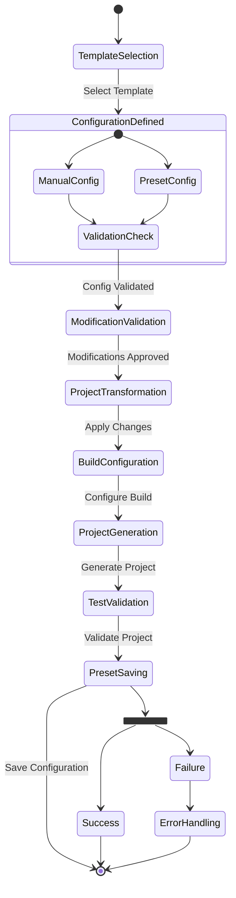

# State Diagram

```mermaid
stateDiagram-v2
    [*] --> TemplateSelection
    TemplateSelection --> ConfigurationDefined: Select Template
    
    state ConfigurationDefined {
        [*] --> ManualConfig
        [*] --> PresetConfig
        ManualConfig --> ValidationCheck
        PresetConfig --> ValidationCheck
    }
    
    ValidationCheck --> ModificationValidation: Config Validated
    ModificationValidation --> ProjectTransformation: Modifications Approved
    
    ProjectTransformation --> BuildConfiguration: Apply Changes
    BuildConfiguration --> ProjectGeneration: Configure Build
    
    ProjectGeneration --> TestValidation: Generate Project
    TestValidation --> PresetSaving: Validate Project
    
    PresetSaving --> [*]: Save Configuration
    
    state fork_state <<fork>>
    PresetSaving --> fork_state
    fork_state --> Success
    fork_state --> Failure
    
    Success --> [*]
    Failure --> ErrorHandling
    ErrorHandling --> [*]
```
