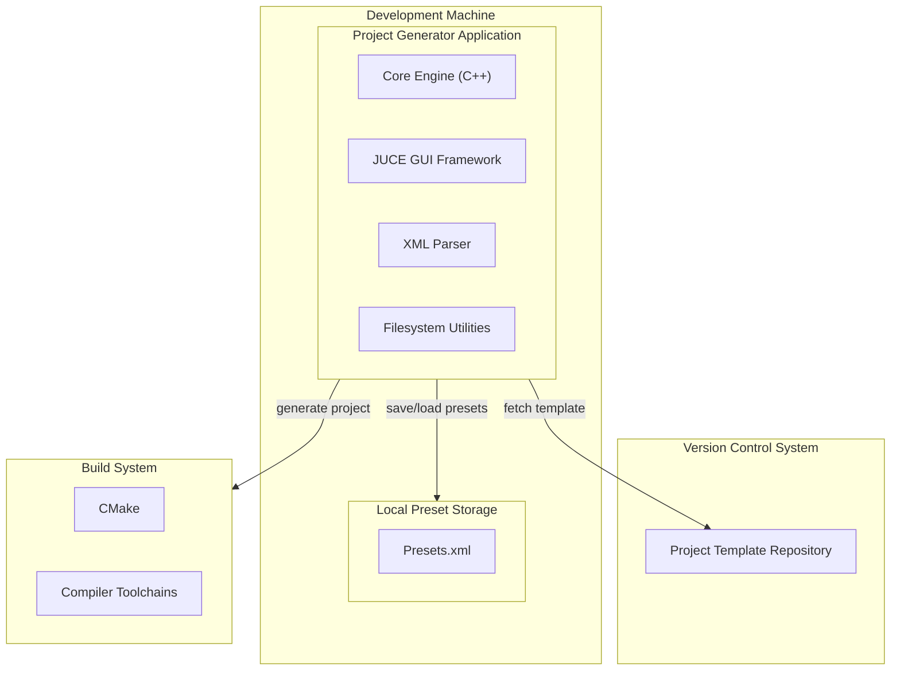

```mermaid
flowchart TD
    subgraph DevMachine["Development Machine"]
        subgraph ProjGenApp["Project Generator Application"]
            CoreEngine["Core Engine (C++)"]
            JuceGUI["JUCE GUI Framework"]
            XMLParser["XML Parser"]
            FSUtils["Filesystem Utilities"]
        end
        
        subgraph LocalStorage["Local Preset Storage"]
            Presets["Presets.xml"]
        end
    end
    
    subgraph VCS["Version Control System"]
        TemplateRepo["Project Template Repository"]
    end
    
    subgraph BuildSystem["Build System"]
        CMake["CMake"]
        Compilers["Compiler Toolchains"]
    end
    
    ProjGenApp -->|fetch template| TemplateRepo
    ProjGenApp -->|generate project| BuildSystem
    ProjGenApp -->|save/load presets| LocalStorage
```