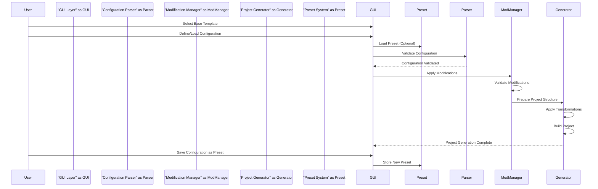

```mermaid
sequenceDiagram
    participant User
    participant "GUI Layer" as GUI
    participant "Configuration Parser" as Parser
    participant "Modification Manager" as ModManager
    participant "Project Generator" as Generator
    participant "Preset System" as Preset
    
    User->>GUI: Select Base Template
    User->>GUI: Define/Load Configuration
    GUI->>Preset: Load Preset (Optional)
    GUI->>Parser: Validate Configuration
    Parser-->>GUI: Configuration Validated
    
    GUI->>ModManager: Apply Modifications
    ModManager->>ModManager: Validate Modifications
    ModManager->>Generator: Prepare Project Structure
    
    Generator->>Generator: Apply Transformations
    Generator->>Generator: Build Project
    Generator-->>GUI: Project Generation Complete
    
    User->>GUI: Save Configuration as Preset
    GUI->>Preset: Store New Preset
```